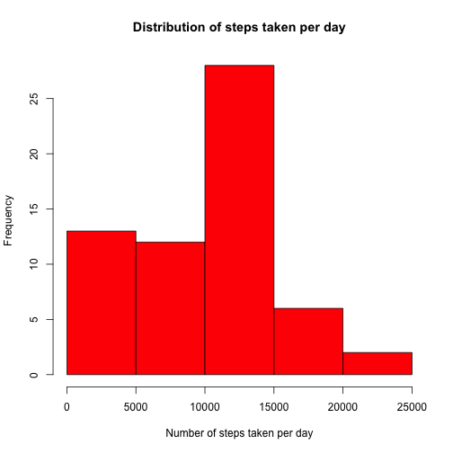
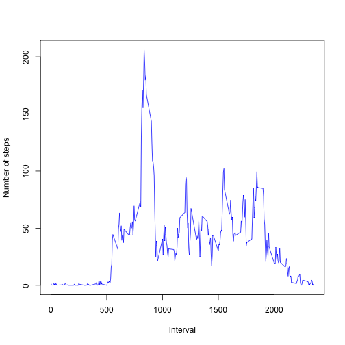
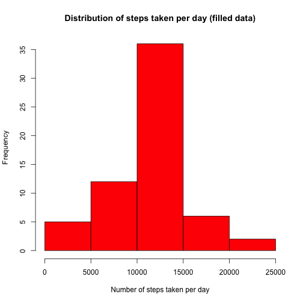
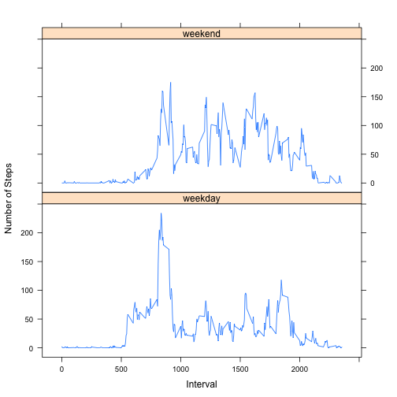

# Reproducible Research: Peer Assessment 1
It is now possible to collect a large amount of data about personal movement using activity monitoring devices such as a Fitbit, Nike Fuelband, or Jawbone Up. These type of devices are part of the ???quantified self??? movement ??? a group of enthusiasts who take measurements about themselves regularly to improve their health, to find patterns in their behavior, or because they are tech geeks. But these data remain under-utilized both because the raw data are hard to obtain and there is a lack of statistical methods and software for processing and interpreting the data.

This assignment makes use of data from a personal activity monitoring device. This device collects data at 5 minute intervals through out the day. The data consists of two months of data from an anonymous individual collected during the months of October and November, 2012 and include the number of steps taken in 5 minute intervals each day.

## Loading and preprocessing the data

The working data is already downloaded in the working directory, so in the next chunk of code will only be unzipped and read in R.


```r
library(plyr)
# Unzip the data file and read it, then change the date to Date-class type
unzip("activity.zip")
data <- read.csv("activity.csv")
data$date <- as.Date(data$date)
```

## What is mean total number of steps taken per day?

The chunk below creates a histogram of the total number of steps taken per day, showing us that there were 25 days with a measure of steps on the range of 10,000 and 15,000. 


```r
# Compute the total number of steps per day
stepssum <- ddply(data, .(date), summarize, sum = sum(steps, na.rm = TRUE))
meansum <- mean(stepssum$sum)
mediansum <- median(stepssum$sum)
# Make a histogram with the frequency of number of steps
hist(stepssum$sum, main = "Distribution of steps taken per day", xlab = "Number of steps taken per day", 
    ylab = "Frequency", col = "Red")
```

 


The total steps per day variable has a mean of 9354.2295 and a median of 10395

## What is the average daily activity pattern?

This section shows the pattern on time intervals, showing first a plot of the mean of steps by interval vs interval. This plot shows that in the first intervals the people don't move a lot, and the values are near to 0. The average number of steps have a huge boost beyond the 500 interval, having the highest peak at the interval 835. This effect on the plot can be explained because at 5:00 the people begins their daily activities, and at 8:35 the people are doing activities that requires more movement than in other intervals. After that point, the activity have a considerable decrease, having other peaks but not with lowest values than the 835 interval. This can be explained because the people in the data set are more stable in one place, like their work or school. Finally, the activity have a decreasing tendency after the 2000 interval. This can be explained because at that time, people are at home resting. 


```r
prueba <- ddply(data, .(interval), summarize, mean = mean(steps, na.rm = TRUE))
plot(prueba$interval, prueba$mean, type = "l", xlab = "Interval", ylab = "Number of steps", 
    col = "Blue")
```

 

```r
## Computes the interval with the maximum number of steps
max <- prueba[which.max(prueba$mean), ]
```


The interval that contains, on average, more steps is 835 which have 206.1698 steps

## Imputing missing values

The next chunk of code will count the number of rows where data was not available (NA). To avoid the NA's, a new data set is created replacing the NA values with the mean of the time interval where the NA value is contained. 


```r
# Counts the number of NA's in the data set.
nasteps <- sum(is.na(data$steps))
# Create a data set copying the original data set first.
filleddata <- data
# Create a boolean vector containing the rows where are located NA values.
na <- is.na(filleddata$steps)
# Matches the interval where the NA values are located with the mean
# computed on a chunk before.
matches <- match(filleddata$interval[na], prueba$interval)
# Replaces the NA value with the mean of the time interval.
filleddata$steps[na] <- prueba[matches, 2]
```


Comparing the histogram made with the original data set, and this histogram made with filled data, it is noticed that the distribution of the total number of steps per day change, decreasing the frequencies of the first two intervals (0-5,000 and 5,000-10,000), and increasing the frequencies of the interval (5000-10,000 number of steps). So, we can conclude that filling the data with the means of time intervals drives us to a more normal like distribution, with more values nearby the mean. 


```r
# Calculate total number of steps, their median and the mean
filledsumsteps <- ddply(filleddata, .(date), summarize, sum = sum(steps))
meanfilledsum <- mean(filledsumsteps$sum)
medianfilledsum <- median(filledsumsteps$sum)
# Make a new histogram
hist(filledsumsteps$sum, main = "Distribution of steps taken per day (filled data)", 
    xlab = "Number of steps taken per day", ylab = "Frequency", col = "Red")
```

 


The mean of the filled data steps is 1.0766 &times; 10<sup>4</sup> and the median is 1.0766 &times; 10<sup>4</sup>

## Are there differences in activity patterns between weekdays and weekends?

In this section is analyzed the differences between weekdays and weekends activity. In the panel plot can be visualized both categories of days. In general, the form of both plots are very similar, having both plots peaks on the same intervals.The similarities are that both plots present highest values of steps beyond the 500 interval. Also both have a decreasing tendency beyond the 2000 interval. 
The main differences are that weekends days have highest peaks than the weekdays, but the highest value of steps is on a weekday somewhere between the 500 and 1000 interval. 
With the information described above, we can conclude that in general, there is more activity registration on weekends than in weekdays, probably because the people measuring their steps tends to stay out of their homes on weekends, causing to walk more.


```r
library("lattice")
# Create a new variable in the data set that is the weekday of the date
data$weekday <- weekdays(data$date)
# Create a table to look up the values of the days, and match them with
# weekends or weekdays.
days <- c("Monday", "Tuesday", "Wednesday", "Thursday", "Friday", "Saturday", 
    "Sunday")
fact <- c(rep("weekday", 5), rep("weekend", 2))
weekdaystable <- cbind(days, fact)
# Matches the weekday of the data set with the look up table, to assign a
# value to the new variable of the data set named fact.
weekdaymatches <- match(data$weekday, weekdaystable[, 1])
data$fact <- weekdaystable[weekdaymatches, 2]
# Creates a data frame with the mean of the steps by interval and by type of
# day (weekend or weekday)
meantable <- ddply(data, .(interval, fact), summarize, mean = mean(steps, na.rm = TRUE))
# Make a panel plot, on the top the weekend inteval vs average steps plot,
# on the bottom the weekdays interval vs average steps plot.
xyplot(meantable$mean ~ meantable$interval | meantable$fact, layout = c(1, 2), 
    type = "l", xlab = "Interval", ylab = "Number of Steps")
```

 


